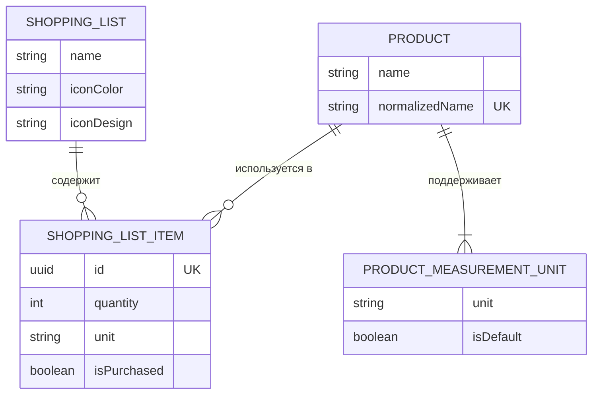

# DemoSwiftData

Небольшое учебное приложение со списками покупок. Проект показывает базовую работу со SwiftData без `@Query` и без передачи `ModelContext` напрямую во View: чтение и изменение данных выполняются через отдельные store-объекты.

## Быстрый старт

1. Откройте `DemoSwiftData.xcodeproj` в Xcode.
2. Выберите iOS Simulator и запустите схему `DemoSwiftData`.
3. Кнопки CRUD выполняют операции над четырьмя моделями SwiftData. Результаты чтения и краткие сообщения об изменениях выводятся в консоль Xcode.
4. Кнопка «Восстановить демо-данные» заменяет текущие записи начальными. Если постоянное хранилище не удалось открыть, экран восстановления позволяет повторить загрузку или пересоздать тестовую базу.

Основной код persistence-слоя находится в каталоге [`DemoSwiftData/Data`](DemoSwiftData/Data).

## Экран списка товаров

Вкладка «Товары» показывает каталог из `ProductStoreProtocol` и поддерживает:

- поиск по названию и обновление жестом pull-to-refresh;
- создание и редактирование товара с выбором доступных и основной единиц измерения;
- удаление с подтверждением и предупреждением о связанных позициях списков;
- состояния первой загрузки, пустого результата, ошибки и выполняемой мутации.

Фича организована по IVO:

- `ProductListItem` — `Identifiable`-снимок данных для строки списка;
- `ProductsView` и `ProductEditorView` — декларативный SwiftUI-интерфейс;
- `ProductsObserved` — `@Observable`-состояние и асинхронные пользовательские операции.

View не получает ни `ModelContext`, ни SwiftData-модели и работает с persistence-слоем через
`ProductCatalogStoreProtocol`. Store возвращает обычный `ProductDetails`, принимает `ProductInput`
и скрывает сопоставление UI-идентификатора с `PersistentIdentifier`. Загрузка и изменения
запускаются из SwiftUI-задач через `async`/`await`, а доступ к SwiftData остаётся изолированным
на `MainActor` внутри store.

## Модель данных

Диаграмма описывает логические сущности приложения. Это не буквальная схема внутренних таблиц SQLite: SwiftData самостоятельно добавляет служебные идентификаторы и внешние ключи.



Обозначения: `||` — ровно одна запись, `o{` — от нуля до многих, `|{` — одна или несколько, `UK` — уникальное значение.

В терминах предметной области списки и товары имеют связь many-to-many: один список содержит много товаров, а один товар может входить в разные списки. Она реализована через отдельную сущность `ShoppingListItem`. Это необходимо, потому что количество, выбранная единица измерения и статус покупки относятся не к товару вообще, а к товару в конкретном списке.

### `ShoppingList`

Один список покупок. Хранит название, цвет и дизайн иконки, а также массив `items`.

- `name` не может быть пустым;
- `iconColor` и `iconDesign` — `Codable`-перечисления для оформления;
- `items` — обратная сторона связи с `ShoppingListItem`;
- `sortedItems`, `purchasedItemsCount` и `progress` вычисляются в памяти и отдельно не сохраняются;
- удаление списка каскадно удаляет все его позиции.

Исходный код: [`ShoppingList.swift`](DemoSwiftData/Data/Models/ShoppingList.swift).

### `Product`

Запись общего каталога товаров. Один и тот же товар, например «Яблоки», переиспользуется в нескольких списках.

- `name` — отображаемое название;
- `normalizedName` — обрезанное, приведённое к единому регистру имя с ограничением `.unique`; оно не позволяет создать «Молоко» и « молоко » как разные товары;
- `listItems` — все позиции списков с этим товаром;
- `measurementUnits` — допустимые для товара единицы;
- удаление товара каскадно удаляет его единицы и все позиции этого товара во всех списках.

Исходный код: [`Product.swift`](DemoSwiftData/Data/Models/Product.swift).

### `ProductMeasurementUnit`

Одна допустимая единица измерения конкретного товара. Например, у молока могут быть записи «литры» и «миллилитры».

- `unit` хранит значение `MeasurementUnit`;
- `isDefault` — булев признак единицы измерения по умолчанию;
- `product` указывает на владельца;
- у товара по правилам приложения должна оставаться хотя бы одна единица;
- у каждого товара ровно одна единица имеет `isDefault == true`: назначение новой единицы по умолчанию снимает признак с предыдущей, а удаление текущей основной единицы назначает другую из оставшихся;
- store не разрешает дублировать единицу или удалить её, пока она используется в позиции списка.

`ShoppingListItem` не имеет прямой связи с `ProductMeasurementUnit`: он хранит выбранное значение `MeasurementUnit`, а согласованность проверяется доменной валидацией и `ProductStore`.

Исходный код: [`ProductMeasurementUnit.swift`](DemoSwiftData/Data/Models/ProductMeasurementUnit.swift).

### `ShoppingListItem`

Связующая сущность между списком и товаром.

- `id` — прикладной уникальный `UUID`; кроме него SwiftData поддерживает собственную внутреннюю идентичность модели;
- `quantity` — положительное количество;
- `unit` — выбранная единица, которую должен поддерживать товар;
- `isPurchased` — отметка о покупке;
- `createdAt` — дата создания, используемая при сортировке;
- `shoppingList` и `product` — обязательные ссылки на список и товар.

Позиция не может существовать без списка или товара: обе связи имеют non-optional тип, а инициализатор требует передать оба объекта. При удалении списка или товара связанная позиция удаляется целиком по правилу `.cascade`, поэтому запись с отсутствующим родителем в хранилище не остаётся.

Если в один список повторно добавить тот же товар с той же единицей, `ShoppingStore` увеличит количество существующей позиции, а не создаст дубликат.

Исходный код: [`ShoppingListItem.swift`](DemoSwiftData/Data/Models/ShoppingListItem.swift).

### Валидация предметной области

Правила проверки названий, количества и единиц измерения отделены от сохраняемых моделей и находятся в каталоге `Data/Validation`. `ShoppingDomainValidation` возвращает проверенные значения или выбрасывает локализованную `ShoppingDomainError`.

Исходный код: [`ShoppingDomainValidation.swift`](DemoSwiftData/Data/Validation/ShoppingDomainValidation.swift).

## Как собирается persistence-слой

На старте объекты создаются в следующем порядке:

```mermaid
flowchart LR
    App[DemoSwiftDataApp] --> Bootstrap[PersistenceBootstrap]
    Bootstrap --> Factory[PersistenceFactory]
    Factory --> Schema[Schema]
    Factory --> Configuration[ModelConfiguration]
    Schema --> Container[ModelContainer]
    Configuration --> Container
    Container --> Context[общий ModelContext]
    Context --> ProductStore[ProductStore]
    Context --> ShoppingStore[ShoppingStore]
    ProductStore --> ShoppingStore
    ShoppingStore --> Seeder[DemoDataSeeder]
    ProductStore --> Dependencies[PersistenceDependencies]
    ShoppingStore --> Dependencies
    Seeder --> Dependencies
    Dependencies --> RootView[RootView / CRUDDemoView]
    RootView --> Observed[CRUDDemoObserved]
```



### 1. `PersistenceBootstrap`

Создаётся в `DemoSwiftDataApp` и вызывает `PersistenceFactory.makeProduction()`. Он хранит либо готовые зависимости, либо текст ошибки открытия базы. Это объект состояния запуска приложения, а не объект SwiftData.

### 2. `PersistenceFactory`

Единая точка сборки persistence-слоя:

1. создаёт `Schema`;
2. выбирает `ModelConfiguration`;
3. открывает `ModelContainer`;
4. создаёт один общий `ModelContext`;
5. передаёт контейнер и контекст в stores;
6. создаёт `DemoDataSeeder` и при необходимости записывает демо-данные;
7. возвращает всё необходимое как `PersistenceDependencies`.

`makeProduction()` использует постоянную конфигурацию `ShoppingData`. `makePreview()` создаёт хранилище только в памяти, поэтому данные исчезают вместе с preview. `recreateProductionStore()` удаляет файл тестового хранилища и его служебные sidecar-файлы, после чего создаёт базу заново.

Исходный код: [`PersistenceFactory.swift`](DemoSwiftData/Data/PersistenceFactory.swift).

### 3. `PersistenceDependencies`

Простой контейнер зависимостей приложения. Он объединяет:

- `ShoppingStoreProtocol` для списков и позиций;
- `ProductStoreProtocol` для товаров и единиц;
- `DemoDataSeeding` для начального заполнения и сброса данных.

Здесь наружу передаются протоколы, а не конкретные классы. Поэтому UI не зависит напрямую от реализации на SwiftData, а store можно заменить тестовой реализацией.

### 4. Stores

`ProductStore` отвечает за каталог товаров и допустимые единицы. `ShoppingStore` отвечает за списки, позиции и операции, затрагивающие сразу несколько типов моделей. Оба работают на `@MainActor` и используют один экземпляр `ModelContext` — так составное изменение попадает в одну единицу работы.

Дополнительный протокол `ProductStoreCoordinating` открывает для `ShoppingStore` внутренние операции без самостоятельного `save()`. Например, при добавлении позиции `ShoppingStore` может найти или создать товар, вставить позицию и только затем сохранить весь согласованный граф.

Обычный путь записи выглядит так:

```text
CRUDDemoView
  → CRUDDemoObserved
  → ShoppingStoreProtocol / ProductStoreProtocol
  → конкретный Store
  → ModelContext.insert/delete и изменение @Model
  → ModelContext.save()
```

При ошибке сохранения store вызывает `rollback()`, чтобы отменить несохранённые изменения контекста.

Исходный код: [`ShoppingStore.swift`](DemoSwiftData/Data/Stores/ShoppingStore.swift) и [`ProductStore.swift`](DemoSwiftData/Data/Stores/ProductStore.swift).

### 5. `DemoDataSeeder`

Заполняет пустое хранилище начальными списками и товарами. Он не импортирует SwiftData и общается со store через `DemoDataApplying`, поэтому описание демо-данных отделено от способа их хранения.

Для production факт первого заполнения хранится в `UserDefaults`. При полном сбросе каждая `ShoppingListItem` сначала удаляется в отдельном коротком `ModelContext`: это не оставляет invalidated-позиции в inverse-массивах двух cascade-родителей. После удаления связей корневые `ShoppingList` и `Product` заменяются начальными данными в чистом контексте. В завершение `ShoppingStore` создаёт свежий `ModelContext` и передаёт его `ProductStore`.

Исходный код: [`DemoDataSeeder.swift`](DemoSwiftData/Data/DemoData/DemoDataSeeder.swift).

## Основные понятия SwiftData в этом проекте

### `@Model`

Макрос превращает обычный `final class` в сохраняемую модель SwiftData. Фреймворк начинает отслеживать экземпляры класса, их свойства и связи. В проекте так объявлены `ShoppingList`, `Product`, `ProductMeasurementUnit` и `ShoppingListItem`.

Модели являются ссылочными типами: после получения объекта из контекста его свойства можно изменить, а затем вызвать `save()` у контекста.

### `Schema`

Схема перечисляет типы моделей, известные хранилищу:

```swift
Schema([
    ShoppingList.self,
    Product.self,
    ProductMeasurementUnit.self,
    ShoppingListItem.self
])
```

При добавлении нового `@Model` его нужно включить в схему. В учебном проекте нет `VersionedSchema` и плана миграции: несовместимую тестовую базу можно пересоздать с экрана восстановления, но в реальном приложении изменение выпущенной схемы требует продуманной миграции.

### `ModelConfiguration`

Конфигурация описывает, как и где хранить данные для схемы.

- production-конфигурация с именем `ShoppingData` записывает данные на диск;
- preview-конфигурация использует `isStoredInMemoryOnly: true` и не создаёт постоянную базу.

### `ModelContainer`

Контейнер открывает и обслуживает физическое хранилище в соответствии со схемой и конфигурацией. Это долгоживущий корневой объект persistence-стека. Сам UI не выполняет через него CRUD: для этого создаётся `ModelContext`.

Stores удерживают и контейнер, и контекст. Это явно сохраняет контейнер на всё время работы с контекстом и позволяет создать новый контекст после полного сброса данных.

### `ModelContext`

Контекст — рабочая область для моделей, похожая на «черновик изменений» и единицу работы. Через него код:

- получает модели методом `fetch`;
- регистрирует новые модели методом `insert`;
- помечает модели на удаление методом `delete`;
- фиксирует накопленные изменения методом `save`;
- отменяет несохранённые изменения методом `rollback`;
- объединяет несколько действий методом `transaction`.

Оба store используют один контекст на `MainActor`. Не следует произвольно передавать этот контекст в другой actor или смешивать в одной операции модели из разных контекстов.

### `@Attribute(.unique)`

Уникальный атрибут не допускает одинаковые значения в хранилище. В проекте он применяется к `ShoppingListItem.id` и `Product.normalizedName`. Проверка дубликата имени также выполняется заранее в `ProductStore`, чтобы показать понятную доменную ошибку.

Для составных Swift-имён через `originalName` указаны соответствующие имена предыдущей схемы в snake_case: `iconColor` → `icon_color`, `iconDesign` → `icon_design`, `normalizedName` → `normalized_name`, `isPurchased` → `is_purchased` и `createdAt` → `created_at`. `originalName` используется SwiftData для сопоставления переименованных атрибутов при миграции; это не отдельное правило преобразования всех имён в SQLite.

### `@Relationship`

Связь описывает переход между моделями. Параметр `inverse` указывает обратное свойство, а `deleteRule: .cascade` означает удаление дочерних записей вместе с родителем.

Связи `ShoppingListItem.shoppingList` и `ShoppingListItem.product` обязательны. Такая позиция всегда принадлежит ровно одному списку и ссылается ровно на один товар.

В текущей схеме каскадно удаляются:

- позиции при удалении `ShoppingList`;
- позиции и допустимые единицы при удалении `Product`.

Удаление одной позиции не удаляет её товар или список. Удаление одной `ProductMeasurementUnit` также не удаляет товар.

### `FetchDescriptor`, `SortDescriptor` и `#Predicate`

`FetchDescriptor<Model>` описывает запрос к контексту. В него можно добавить сортировку и условие:

- `ShoppingList` сортируется по имени;
- `ShoppingListItem` — по дате создания;
- отдельный запрос `ShoppingListItem` фильтрует позиции по `persistentModelID` списка и сортирует их по имени связанного `Product`;
- `Product` — по нормализованному имени;
- `#Predicate<Product>` используется для поиска товара по `normalizedName`;
- `fetchLimit = 1` ограничивает поиск одним результатом.

## Где находится ответственность

| Слой | Объекты | Ответственность |
| --- | --- | --- |
| Запуск | `DemoSwiftDataApp`, `PersistenceBootstrap` | Создать persistence-слой или показать восстановление после ошибки |
| Сборка | `PersistenceFactory`, `PersistenceDependencies` | Настроить схему, контейнер, общий контекст и зависимости |
| Доступ к данным | `ShoppingStore`, `ProductStore` и их протоколы | Выполнять CRUD, запросы, транзакции и сохранение |
| Демо-данные | `DemoDataSeeder`, `DemoData` | Первичное заполнение и полный сброс |
| Домен | четыре `@Model`, `MeasurementUnit`, `ShoppingDomainValidation` | Хранить состояние и защищать базовые правила предметной области |
| Представление | `ProductsObserved`, `ProductsView`, `CRUDDemoObserved`, `CRUDDemoView` | Преобразовать действия пользователя в вызовы store и показать результат |

`ShoppingDomainValidation` проверяет непустые названия, положительное количество, наличие хотя бы одной единицы и допустимость выбранной единицы для товара. Такая проверка дополняет ограничения SwiftData: фреймворк отвечает за хранение и связи, а правила предметной области остаются в коде приложения.

## Как добавить новую модель

Минимальный порядок действий:

1. Создать `final class` с `@Model` и определить его свойства и связи.
2. Добавить тип в `Schema` внутри `PersistenceFactory`.
3. Добавить операции в подходящий store и его протокол, не передавая `ModelContext` во View.
4. Добавить доменную валидацию и понятные ошибки, если у модели есть бизнес-ограничения.
5. Обновить демо-данные и учесть порядок каскадного удаления, если новая модель участвует в связях.
6. Для уже выпущенного приложения подготовить версионированную схему и миграцию вместо удаления пользовательской базы.
